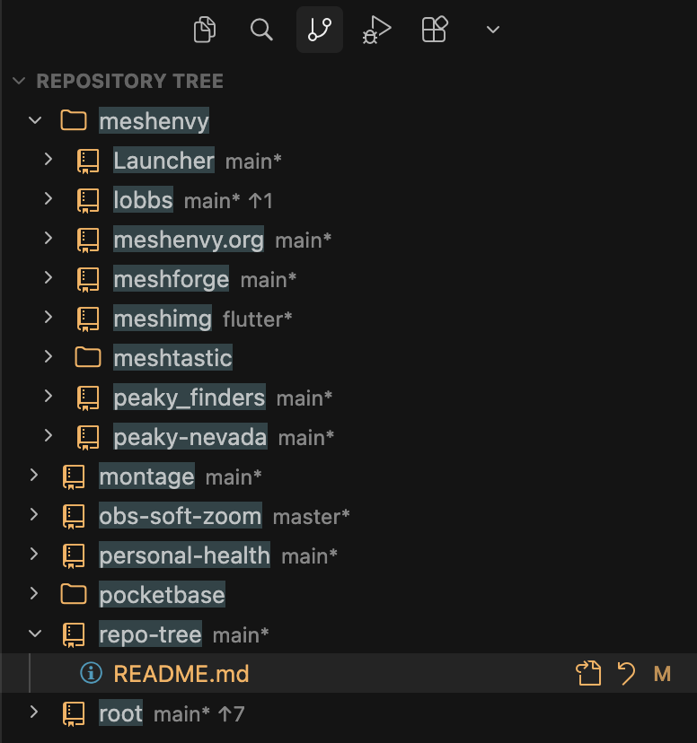

# Repository Tree

**Repository Tree** is a new way to visualize complex agentic repository layouts: many independent git roots, nested submodules, and unrelated projects that still live in one workspace.

I keep a single monolithic workspace of all my projects and priorities in one IDE instance. In practice, agents are far better at making modifications when cross-project context is available in that window. Cursor’s default **Repositories** list and per-repo **Changes** views do not scale when you have a large portfolio of roots and nested checkouts.

This extension improves on that default by presenting a **tree** you can navigate for change review and change management: folder-grouped repos, path-nested dirty files under each repo, and the same diff, revert, and git actions without hopping between flat lists.

[Video walkthrough](https://youtu.be/XgD1qGyHyfU)



## Install locally

```bash
./scripts/install.sh
```

Reload the window. The script bumps a local build suffix in `package.json` (for example `0.2.1-b64`), then symlinks this repo into `~/.cursor/extensions/benallfree.repo-tree-<version>`. Counters live in gitignored `.build-number` and `.build-base`. Set the semver prefix in `package.json` when you cut a release; the next install starts `-b1` for that base.

Hide the built-in **Repositories** section from Source Control → `...` → Views if you only want the tree.

## Usage

### View toolbar

| Control | Action |
| --- | --- |
| Tree / flat | Toggle nested folders vs a single sorted list |
| Sort | Name, or recent WIP (last dirty activity in this window) |
| Filter | Hide clean repos; tree mode keeps parent folders |

For inline **Revert** on changed file and path-folder rows, set `"scm.alwaysShowActions": true` in settings.

### Dirty repos

Expand a dirty repo to see changed files nested by path (no Staged/Changes section headers). Click a changed file row to open the diff (`git.openChange`). The go-to-file icon opens the working copy in the editor. **Revert** on a file or folder unstages and discards back to HEAD (including untracked under that path). Repo rows keep sync, pull, and push.

If [Git Graph](https://marketplace.visualstudio.com/items?itemName=mhutchie.git-graph) or GitLens is installed, the same graph action that **Changes** shows on each repository appears on the repo row.

## Develop

```bash
npm install
npm test
npm run compile
```

Open this folder in Cursor, run **Run Extension** (`.vscode/launch.json`). The Extension Development Host opens `root.code-workspace`.

Release notes: [CHANGELOG.md](./CHANGELOG.md).
